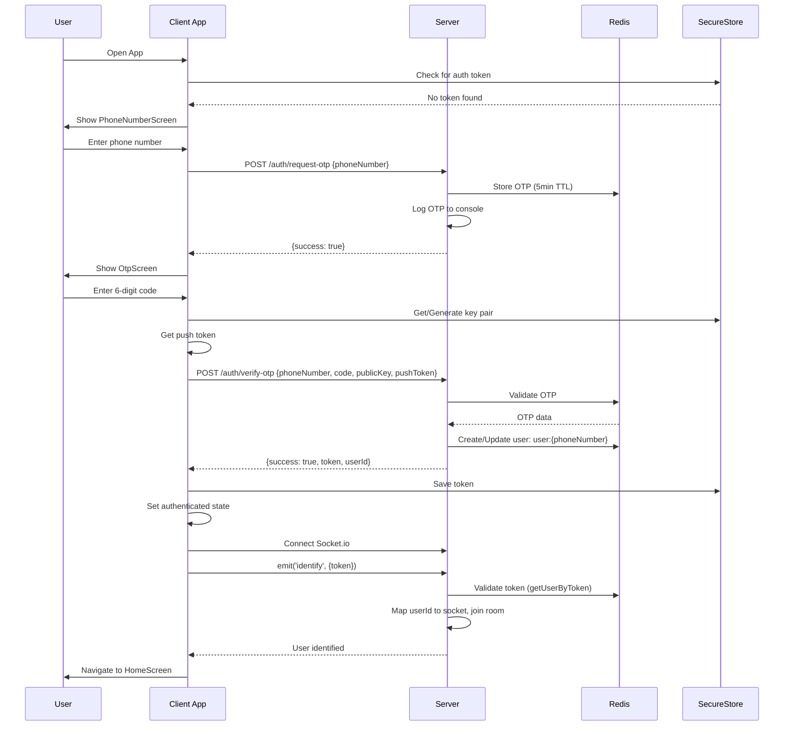
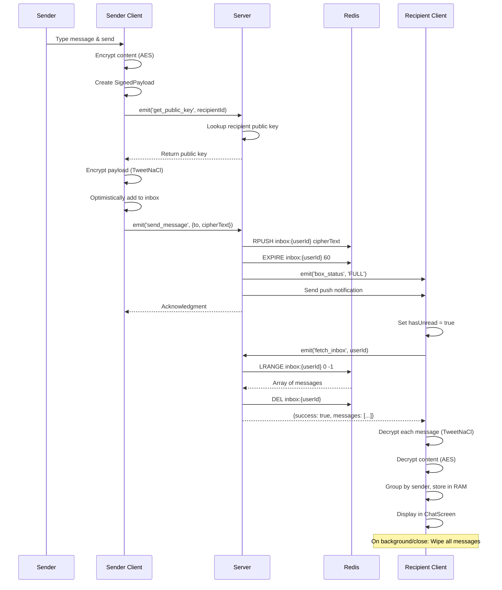
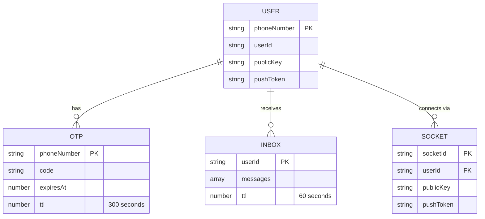

# Purple Box - Project Documentation

## 1. Product Requirements Document (PRD)

### Goal
Purple Box is a privacy-focused, ephemeral messaging application that enables secure, end-to-end encrypted communication between users. The core principle is that messages are **never persisted** - they exist only in RAM and are automatically wiped when the app goes to background or closes. The app follows a "box" metaphor where users receive notifications that "the box is full" when messages arrive, and must actively check their inbox to retrieve messages.

### Features List

#### Authentication & User Management
- **Phone Number Registration**: Users enter their phone number to begin authentication
- **OTP Verification**: 6-digit OTP code sent via console log (mocked SMS for MVP)
- **Session Token Management**: Simple token-based authentication (token = userId for MVP)
- **Persistent Auth State**: Auth tokens stored in Expo SecureStore (persists across app restarts)
- **Push Notification Registration**: Automatic registration for Expo push notifications during OTP verification

#### Messaging
- **End-to-End Encrypted Messaging**: Messages encrypted using TweetNaCl (NaCl box encryption) with ephemeral key pairs
- **Real-time Message Delivery**: Socket.io-based real-time messaging
- **Ephemeral Message Storage**: Messages stored in Redis with 60-second TTL, automatically deleted after retrieval
- **Inbox Management**: Users can view all messages grouped by sender
- **Chat Interface**: One-on-one chat interface with message history (RAM only)
- **Message Wiping**: All messages wiped from RAM when app goes to background or closes
- **Box Status Notifications**: Real-time "box_full" notifications when messages arrive

#### Contacts
- **Contact Sync**: Syncs device contacts with server to find registered users
- **Phone Number Normalization**: Normalizes phone numbers to E.164 format (defaults to Tanzania country code)
- **Contact List**: Displays synced contacts with names from device contacts
- **Public Key Exchange**: Automatically retrieves recipient's public key for encryption

#### Privacy & Security
- **Screenshot Blocking**: Prevents screenshots using `expo-screen-capture` on all screens
- **No Message Persistence**: Messages never saved to disk (client or server)
- **Secure Key Storage**: Encryption keys stored in Expo SecureStore
- **Server-Side Encryption**: Server never decrypts messages (only handles encrypted payloads)

#### User Interface
- **Home Screen**: Central box icon that pulses when messages are available
- **Inbox List Screen**: Lists all senders with message counts
- **Chat Screen**: One-on-one chat interface with message bubbles
- **Contact Selection**: Screen to select recipient from synced contacts
- **Dark Theme**: Black background with purple accent color (#8A2BE2)

### User Roles
Based on the authentication and authorization logic:
- **User**: Standard authenticated user. No admin or special roles identified in the codebase. All authenticated users have the same permissions.

---

## 2. User Journey Maps & Flowcharts

### Critical Action 1: Creating an Account / Authentication

**Text Description:**
1. User opens app → App checks SecureStore for existing auth token
2. If no token → Navigate to PhoneNumberScreen
3. User enters phone number → Client sends `POST /auth/request-otp` with phone number
4. Server generates 6-digit OTP, stores in Redis with 5-minute TTL, logs to console
5. Client navigates to OtpScreen
6. User enters 6-digit code
7. Client generates encryption key pair (or loads from SecureStore), gets push token
8. Client sends `POST /auth/verify-otp` with phone number, code, public key, and push token
9. Server validates OTP, creates/updates user in Redis (`user:{phoneNumber}`), generates session token (userId)
10. Client saves token to SecureStore, sets authenticated state, connects Socket.io
11. Client emits `identify` event with token
12. Server validates token, maps userId to socket, joins user to room
13. App navigates to HomeScreen (automatic via App.tsx routing logic)

**Mermaid Diagram:**


### Critical Action 2: Sending a Message

**Text Description:**
1. User on HomeScreen taps compose button → Navigate to ContactListScreen
2. User selects contact → Navigate to ChatScreen with targetUser
3. User types message and sends
4. Client constructs SignedPayload (sender, encrypted message content, timestamp)
5. Client encrypts message content with AES (crypto-js) using hardcoded secret key
6. Client requests recipient's public key via Socket.io `get_public_key` event
7. Server looks up recipient in userSockets map or Redis, returns public key
8. Client encrypts entire payload JSON using TweetNaCl with recipient's public key (ephemeral key pair)
9. Client optimistically adds message to local inbox (for immediate UI feedback)
10. Client emits `send_message` event with {to: userId, cipherText: encryptedPayload}
11. Server receives message, appends to Redis list `inbox:{userId}` with 60s TTL
12. Server emits `box_status: 'FULL'` to recipient's room
13. Server sends push notification to recipient (if push token exists)
14. Server sends acknowledgment to sender
15. Recipient receives `box_status` event, sets hasUnread flag
16. When recipient opens inbox, emits `fetch_inbox` with userId
17. Server retrieves all messages from Redis list, immediately deletes the key
18. Server returns array of encrypted messages
19. Client decrypts each message using TweetNaCl, then decrypts content with AES
20. Client groups messages by sender, stores in RAM-only Zustand store
21. Messages displayed in ChatScreen
22. When user leaves ChatScreen or app goes to background, all messages wiped from RAM

**Mermaid Diagram:**


---

## 3. Technical Design Document (TDD)

### Tech Stack

#### Client (React Native / Expo)
- **Framework**: Expo SDK ~54.0.31
- **Language**: TypeScript 5.9.2
- **UI Framework**: React Native 0.81.5, React 19.1.0
- **Navigation**: React Navigation 7.x (Native Stack Navigator)
- **State Management**: Zustand 5.0.2
- **Real-time Communication**: Socket.io-client 4.8.3
- **Cryptography**: 
  - tweetnacl 1.0.3 (NaCl box encryption)
  - tweetnacl-util 0.15.1
  - crypto-js 4.2.0 (AES encryption for message content)
- **Security**: 
  - expo-secure-store ~14.0.0 (key and token storage)
  - expo-screen-capture ~6.0.1 (screenshot blocking)
- **Notifications**: expo-notifications ~0.29.9
- **Contacts**: expo-contacts ~15.0.11
- **Phone Number Parsing**: libphonenumber-js 1.12.34

#### Server (Node.js)
- **Framework**: Fastify 4.29.1
- **Language**: TypeScript 5.9.3
- **Runtime**: Node.js (ESM modules)
- **Real-time Communication**: Socket.io 4.8.3
- **Socket.io Plugin**: fastify-socket.io 5.1.0
- **Redis Adapter**: @socket.io/redis-adapter 8.3.0
- **Database/Cache**: 
  - Redis 5.10.0 (via redis package)
  - ioredis 5.9.1 (alternative Redis client)
- **CORS**: @fastify/cors 8.5.0
- **Push Notifications**: expo-server-sdk 4.0.0
- **Environment**: dotenv 17.2.3

### Architecture

**Pattern**: Client-Server with Real-time WebSocket Communication

The application follows a **hybrid architecture** combining:
- **RESTful HTTP API** for authentication and contact syncing
- **WebSocket (Socket.io)** for real-time messaging
- **Ephemeral Redis Storage** for temporary message queuing
- **Client-Side State Management** for RAM-only message storage

**Key Architectural Decisions:**
1. **Zero Persistence**: Messages never written to disk (client or server)
2. **Ephemeral Redis**: All Redis keys have TTL (60s for messages, 5min for OTPs)
3. **Client-Side Encryption**: Server never sees plaintext messages
4. **Stateless Server**: Server maintains minimal in-memory state (userSockets map for active connections)
5. **Push Notifications**: Used for offline message delivery

### Folder Structure

```
box/
├── client/                    # Expo React Native client application
│   ├── screens/              # React Native screen components
│   │   ├── auth/            # Authentication screens (PhoneNumber, OTP)
│   │   ├── HomeScreen.tsx   # Main home screen with box icon
│   │   ├── ChatScreen.tsx   # One-on-one chat interface
│   │   ├── ContactListScreen.tsx  # Contact selection
│   │   └── InboxListScreen.tsx     # Inbox list view
│   ├── stores/              # Zustand state management stores
│   │   ├── useStore.ts      # Main store (messages, socket, auth state)
│   │   ├── useAuthStore.ts  # Authentication and key management
│   │   └── useMessageStore.ts  # Message state (legacy, minimal usage)
│   ├── services/            # Business logic services
│   │   ├── CryptoService.ts # Encryption/decryption (TweetNaCl)
│   │   └── SocketService.ts # Socket.io connection management (legacy)
│   ├── App.tsx              # Root component, navigation setup
│   ├── package.json         # Client dependencies
│   └── eas.json             # Expo Application Services config
│
├── server/                   # Fastify + Socket.io server
│   ├── src/
│   │   ├── index.ts         # Main server file (HTTP routes + Socket.io)
│   │   ├── messageHandler.ts # Message handling logic (legacy, minimal usage)
│   │   ├── redis.ts         # Redis client and message storage functions
│   │   ├── server.ts        # Alternative server setup (legacy, unused)
│   │   └── types.d.ts       # TypeScript type definitions
│   ├── env.template         # Environment variables template
│   └── package.json         # Server dependencies
│
├── package.json              # Root package (test scripts)
├── README.md                 # Project overview and setup
└── PROJECT_DOCUMENTATION.md  # This file
```

**Folder Responsibilities:**
- **client/screens/**: UI components for each screen in the app
- **client/stores/**: Global state management (Zustand stores)
- **client/services/**: Reusable business logic (crypto, socket management)
- **server/src/**: Server-side logic (HTTP routes, Socket.io handlers, Redis operations)

---

## 4. Security & Encryption Protocol

### Authentication

**Method**: Token-based authentication (simplified for MVP)

**Implementation Details:**
- **Token Generation**: Token is simply the `userId` string (no JWT or cryptographic signing)
- **Token Storage**: Stored in Expo SecureStore (client) and Redis (server)
- **Token Validation**: Server looks up user in Redis by iterating through `user:*` keys and matching userId
- **Session Management**: Token persists across app restarts (stored in SecureStore)
- **Socket Authentication**: Client emits `identify` event with token after Socket.io connection

**Security Notes:**
- ⚠️ **Weak Token Security**: Token is just userId (no expiration, no signature). Not production-ready.
- ⚠️ **No Token Refresh**: Tokens never expire or refresh
- ✅ **Secure Storage**: Tokens stored in SecureStore (encrypted storage on iOS/Android)

### Data Security

**Password Storage**: Not applicable - app uses phone number + OTP authentication (no passwords)

**OTP Storage**: 
- Stored in Redis with key `otp:{phoneNumber}`
- TTL: 5 minutes (300 seconds)
- Format: `{code: string, expiresAt: number}`

**User Data Storage**:
- Stored in Redis with key `user:{phoneNumber}`
- Format: `{id: userId, phoneNumber: string, publicKey: string, pushToken: string | null}`
- **No persistence configured**: Redis runs in ephemeral mode (data lost on restart)

### Transport Security

**SSL/TLS**: 
- ⚠️ **Not explicitly enforced in code**: Server listens on HTTP (not HTTPS) by default
- Environment variable `PORT` defaults to 3000 (HTTP)
- Production deployment (Render.com) likely uses HTTPS via reverse proxy, but code doesn't enforce it

**CORS Policy**:
- Configured via `@fastify/cors` plugin
- Default: `CORS_ORIGIN=*` (allows all origins)
- Configurable via `CORS_ORIGIN` environment variable
- ⚠️ **Permissive by default**: Allows all origins (security risk)

**WebSocket Security**:
- Socket.io CORS configured to match HTTP CORS settings
- No additional authentication beyond token-based `identify` event

### Privacy & Message Encryption

**Encryption Stack**:
1. **TweetNaCl (NaCl box)**: End-to-end encryption for message payloads
   - Uses ephemeral key pairs (one-time keys per message)
   - Format: `[nonce(24 bytes) + ephemeralPublicKey(32 bytes) + encryptedMessage]`
   - Base64 encoded for transmission
2. **Crypto-JS (AES)**: Additional encryption layer for message content
   - Hardcoded secret key: `"the_fulcrum_protocol"`
   - ⚠️ **Security Risk**: Hardcoded secret key is a major security vulnerability

**Key Management**:
- **Key Generation**: TweetNaCl `box.keyPair()` generates Ed25519 key pairs
- **Key Storage**: 
  - Stored in Expo SecureStore (encrypted on device)
  - Format: Base64 encoded `[publicKey(32 bytes) + secretKey(32 bytes)]`
  - Keys persist across app restarts
- **Key Exchange**: Public keys exchanged via server during message sending

**Message Storage**:
- **Client**: Messages stored in RAM only (Zustand store)
- **Server**: Messages stored in Redis with 60-second TTL
- **Wiping**: All messages wiped from RAM when app goes to background/close
- **Server-Side**: Server never decrypts messages (only handles encrypted payloads)

**Security Features**:
- ✅ **Screenshot Blocking**: `expo-screen-capture` prevents screenshots on all screens
- ✅ **No Message Persistence**: Messages never written to disk
- ✅ **Ephemeral Storage**: Redis messages auto-expire after 60 seconds
- ✅ **End-to-End Encryption**: Server cannot read message content
- ⚠️ **Hardcoded AES Key**: Major security vulnerability
- ⚠️ **Weak Token Security**: Token is just userId (no cryptographic protection)

---

## 5. Database Schema

### Data Model

The application uses **Redis** as the primary data store. Redis is configured in **ephemeral mode** (no persistence to disk). All data structures are key-value pairs with TTL (Time To Live) expiration.

### ER Diagram



### Schema Detail

#### Redis Keys and Data Structures

**1. User Profile**
- **Key Pattern**: `user:{phoneNumber}`
- **Type**: String (JSON)
- **TTL**: None (persists until Redis restart)
- **Structure**:
  ```typescript
  {
    id: string;           // userId (e.g., "user_1234567890_abc123")
    phoneNumber: string;   // E.164 format (e.g., "+255123456789")
    publicKey: string;     // Base64 encoded public key
    pushToken: string | null;  // Expo push token or null
  }
  ```

**2. OTP (One-Time Password)**
- **Key Pattern**: `otp:{phoneNumber}`
- **Type**: String (JSON)
- **TTL**: 300 seconds (5 minutes)
- **Structure**:
  ```typescript
  {
    code: string;         // 6-digit OTP code
    expiresAt: number;    // Unix timestamp (milliseconds)
  }
  ```

**3. Inbox (Message Queue)**
- **Key Pattern**: `inbox:{userId}`
- **Type**: List (Redis LIST)
- **TTL**: 60 seconds (refreshed on each message append)
- **Structure**: Array of encrypted message strings (Base64)
  - Each list item is a cipherText string (encrypted with TweetNaCl)
  - Messages are appended via `RPUSH`
  - Retrieved via `LRANGE 0 -1` (all items)
  - Deleted immediately after retrieval via `DEL`

**4. In-Memory Socket Mapping (Server Only)**
- **Storage**: JavaScript object in server memory (not Redis)
- **Structure**:
  ```typescript
  {
    [userId: string]: {
      socketId: string;
      publicKey: string;
      pushToken: string | null;
      userId: string;
    }
  }
  ```
- **Purpose**: Maps active socket connections to user IDs for real-time message delivery
- **Lifecycle**: Created on `identify` event, deleted on socket disconnect

### Data Relationships

- **One User → One Profile**: Each phone number maps to one user profile
- **One User → Multiple OTPs**: OTPs are created per authentication attempt (old OTPs overwritten)
- **One User → One Inbox**: Each userId has one inbox list (multiple messages can be queued)
- **One User → One Active Socket**: Each userId can have one active socket connection at a time (new connection overwrites old)

### Notes

- **No Traditional Database**: No SQL database or document store. All data in Redis.
- **No Foreign Keys**: Redis doesn't enforce relationships. Application logic maintains referential integrity.
- **Ephemeral by Design**: All message-related data expires. Only user profiles persist (until Redis restart).
- **No Backup/Recovery**: No persistence means no data recovery. User profiles lost on Redis restart.

---

## 6. API Documentation

### HTTP Endpoints

#### Base URL
- Development: `http://localhost:3000`
- Production: `https://purple-box.onrender.com` (configured via `EXPO_PUBLIC_SERVER_URL`)

#### Endpoints

**1. GET /**
- **Description**: Root endpoint, returns API information
- **Method**: GET
- **Response**:
  ```json
  {
    "name": "Purple Box API",
    "version": "1.0.0",
    "endpoints": {
      "health": "GET /health",
      "requestOTP": "POST /auth/request-otp",
      "verifyOTP": "POST /auth/verify-otp",
      "syncContacts": "POST /contacts/sync"
    }
  }
  ```

**2. GET /health**
- **Description**: Health check endpoint
- **Method**: GET
- **Response**:
  ```json
  {
    "status": "ok",
    "timestamp": "2024-01-01T00:00:00.000Z"
  }
  ```

**3. POST /auth/request-otp**
- **Description**: Request OTP code for phone number authentication
- **Method**: POST
- **Request Body**:
  ```json
  {
    "phoneNumber": "+255123456789"
  }
  ```
- **Response**:
  ```json
  {
    "success": true
  }
  ```
- **Error Response** (400):
  ```json
  {
    "success": false,
    "error": "Invalid phone number"
  }
  ```
- **Notes**: OTP is logged to server console (mocked SMS for MVP)

**4. POST /auth/verify-otp**
- **Description**: Verify OTP code and create/update user account
- **Method**: POST
- **Request Body**:
  ```json
  {
    "phoneNumber": "+255123456789",
    "code": "123456",
    "publicKey": "base64EncodedPublicKey...",
    "pushToken": "ExponentPushToken[...]" | null
  }
  ```
- **Response**:
  ```json
  {
    "success": true,
    "token": "user_1234567890_abc123",
    "userId": "user_1234567890_abc123"
  }
  ```
- **Error Responses**:
  - 400: Invalid phone number, invalid OTP code, OTP expired, or invalid public key
  - 500: Server error
  ```json
  {
    "success": false,
    "error": "OTP not found or expired"
  }
  ```

**5. POST /contacts/sync**
- **Description**: Sync device contacts with server to find registered users
- **Method**: POST
- **Request Body**:
  ```json
  {
    "phoneNumbers": ["+255123456789", "+255987654321", ...]
  }
  ```
- **Response**:
  ```json
  {
    "success": true,
    "users": [
      {
        "phoneNumber": "+255123456789",
        "publicKey": "base64EncodedPublicKey...",
        "userId": "user_1234567890_abc123"
      },
      ...
    ]
  }
  ```
- **Error Response** (400):
  ```json
  {
    "success": false,
    "error": "Invalid phone numbers array"
  }
  ```
- **Notes**: Only returns users that exist in Redis and match the provided phone numbers

### Socket.io Events

#### Client → Server Events

**1. identify**
- **Description**: Authenticate socket connection with token
- **Payload**:
  ```typescript
  {
    token: string;  // Auth token (userId)
  }
  ```
- **Server Response**: None (implicit success) or `error` event on failure

**2. get_public_key**
- **Description**: Get recipient's public key for encryption
- **Payload**: `targetUserId: string`
- **Callback Response**:
  ```typescript
  {
    success: boolean;
    publicKey?: string | null;
    error?: string;
  }
  ```

**3. send_message**
- **Description**: Send encrypted message to recipient
- **Payload**:
  ```typescript
  {
    to: string;        // Recipient userId
    cipherText: string; // Base64 encoded encrypted payload
  }
  ```
- **Server Response**: None (implicit success) or `error` event on failure

**4. fetch_inbox**
- **Description**: Retrieve all messages from user's inbox
- **Payload**: `userId: string`
- **Callback Response**:
  ```typescript
  {
    success: boolean;
    messages?: string[];  // Array of encrypted message strings
    error?: string;
  }
  ```
- **Notes**: Inbox is deleted immediately after retrieval

**5. get_contacts**
- **Description**: Get list of all online user IDs (legacy, deprecated)
- **Payload**: None
- **Callback Response**:
  ```typescript
  {
    success: boolean;
    contacts?: string[];  // Array of userId strings
    error?: string;
  }
  ```

#### Server → Client Events

**1. box_status**
- **Description**: Notification that inbox has messages
- **Payload**: `"FULL"` (string)
- **Trigger**: When message is appended to recipient's inbox

**2. error**
- **Description**: Error notification
- **Payload**:
  ```typescript
  {
    message: string;
  }
  ```

**3. message:ack**
- **Description**: Message acknowledgment (legacy, from old server.ts)
- **Payload**:
  ```typescript
  {
    status: "success" | "error";
    error?: string;
  }
  ```

### Complex Endpoint Details

#### 1. POST /auth/verify-otp (Most Complex)

**Request Body**:
```json
{
  "phoneNumber": "+255123456789",
  "code": "123456",
  "publicKey": "base64EncodedPublicKey...",
  "pushToken": "ExponentPushToken[...]" | null
}
```

**Response**:
```json
{
  "success": true,
  "token": "user_1234567890_abc123",
  "userId": "user_1234567890_abc123"
}
```

**Process Flow**:
1. Validate phone number and code format
2. Retrieve OTP from Redis (`otp:{phoneNumber}`)
3. Check if OTP exists and hasn't expired
4. Verify OTP code matches
5. Delete OTP from Redis
6. Check if user exists in Redis (`user:{phoneNumber}`)
7. If exists: Update user profile with new publicKey and pushToken
8. If not exists: Create new user with generated userId
9. Generate session token (userId)
10. Return token and userId

**Error Cases**:
- Invalid phone number format → 400
- Invalid OTP code format → 400
- OTP not found in Redis → 400
- OTP code mismatch → 400
- OTP expired → 400
- Invalid public key format → 400
- Server error → 500

#### 2. Socket.io: send_message (Most Complex)

**Request**:
```typescript
socket.emit('send_message', {
  to: "user_1234567890_abc123",
  cipherText: "base64EncodedEncryptedPayload..."
});
```

**Process Flow**:
1. Validate `to` and `cipherText` fields
2. Append `cipherText` to Redis list `inbox:{userId}` via `RPUSH`
3. Set/refresh TTL to 60 seconds on the inbox key
4. Emit `box_status: 'FULL'` to recipient's Socket.io room
5. Look up recipient's push token from `userSockets` map
6. If push token exists and is valid Expo token, send push notification
7. Log success (without logging message content)

**Error Cases**:
- Missing `to` or `cipherText` → `error` event
- Redis operation failure → `error` event
- Push notification failure → Logged but doesn't fail message delivery

#### 3. Socket.io: fetch_inbox (Most Complex)

**Request**:
```typescript
socket.emit('fetch_inbox', userId, (response) => {
  // Handle response
});
```

**Response**:
```typescript
{
  success: true,
  messages: [
    "base64EncryptedMessage1...",
    "base64EncryptedMessage2...",
    ...
  ]
}
```

**Process Flow**:
1. Validate userId format
2. Retrieve all messages from Redis list `inbox:{userId}` via `LRANGE 0 -1`
3. Immediately delete the inbox key via `DEL` (prevents re-reading)
4. Return array of encrypted message strings
5. If inbox is empty, return empty array

**Error Cases**:
- Invalid userId format → Callback with `{success: false, error: "Invalid user ID"}`
- Redis operation failure → Callback with error

**Security Note**: Inbox is deleted immediately after retrieval, ensuring messages can only be read once.

---

## Summary

This documentation provides a comprehensive overview of the Purple Box messaging application, covering product requirements, user journeys, technical architecture, security protocols, database schema, and API documentation. The application prioritizes privacy through ephemeral message storage, end-to-end encryption, and screenshot blocking, though some security improvements are needed (hardcoded AES key, weak token security) before production deployment.
