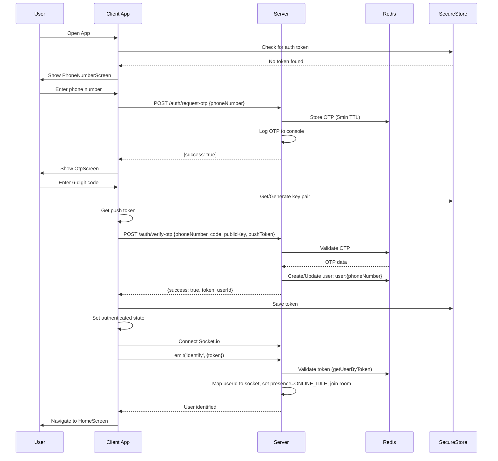
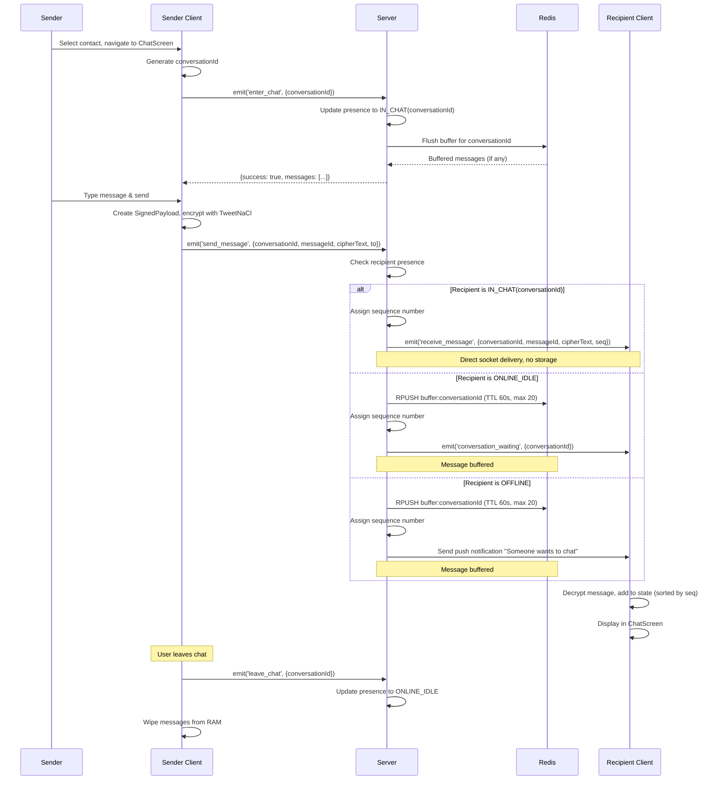
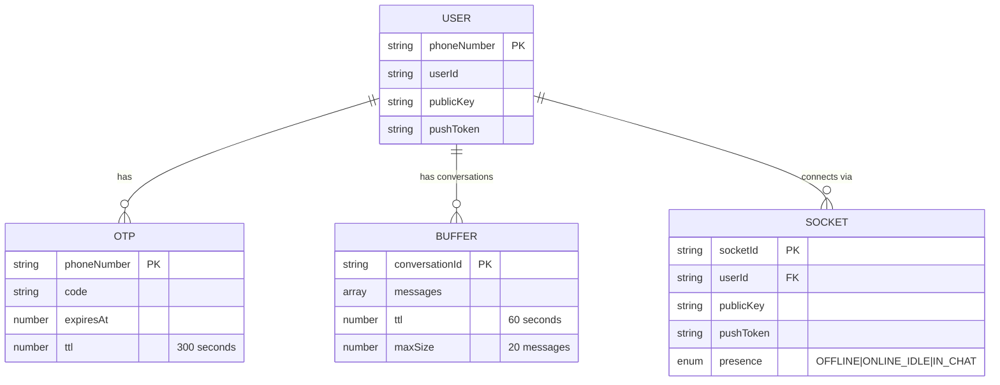

# Purple Box - Project Documentation

## 1. Product Requirements Document (PRD)

### Goal
Purple Box is a privacy-focused, **live conversation** application that enables secure, end-to-end encrypted communication between users. The core principle is that conversations exist **only while participants are present** - messages are never persisted to disk and are automatically wiped when users leave conversations or the app goes to background. The app follows a "live chat" model where conversations exist ephemerally based on user presence.

### Product Promise

> **"Live, private conversations that exist only while you're there."**

**Not:**
- Not async messaging
- Not chat history
- Not guaranteed delivery

This must be **visible in UX, terminology, and system behavior**.

### Features List

#### Authentication & User Management
- **Phone Number Registration**: Users enter their phone number to begin authentication
- **OTP Verification**: 6-digit OTP code sent via console log (mocked SMS for MVP)
- **Session Token Management**: Simple token-based authentication (token = userId for MVP)
- **Persistent Auth State**: Auth tokens stored in Expo SecureStore (persists across app restarts)
- **Push Notification Registration**: Automatic registration for Expo push notifications during OTP verification

#### Messaging (Live Conversations)
- **End-to-End Encrypted Messaging**: Messages encrypted using TweetNaCl (NaCl box encryption) with ephemeral key pairs
- **Presence-Based Delivery**: Messages delivered directly via socket when recipient is in chat, buffered when idle/offline
- **Conversation Model**: Conversations identified by deterministic hash of two user IDs
- **Ephemeral Message Buffer**: Messages stored in Redis buffer (TTL 60s, max 20 messages) when recipient not in chat
- **Real-time Delivery**: Direct socket-to-socket delivery when both users are in the same conversation
- **Server Sequence Numbers**: Messages assigned sequence numbers per conversation for deterministic ordering
- **Message Status Indicators**: Visual status indicators on sent messages (pending spinner, sent ✓, delivered ✓✓) displayed next to timestamps
- **Chat Interface**: One-on-one chat interface with message history (RAM only)
- **Message Wiping**: All messages wiped from RAM when user leaves chat or app goes to background
- **Push Notifications**: "Someone wants to chat" notification when recipient is offline

#### Contacts
- **Contact Sync**: Syncs device contacts with server to find registered users
- **Phone Number Normalization**: Normalizes phone numbers to E.164 format (defaults to Tanzania country code)
- **Contact List**: Displays synced contacts with names from device contacts
- **Public Key Exchange**: Automatically retrieves recipient's public key for encryption

#### Privacy & Security
- **Screenshot Blocking**: Prevents screenshots using `expo-screen-capture` on all screens
- **No Message Persistence**: Messages never saved to disk (client or server)
- **Secure Key Storage**: Encryption keys stored in Expo SecureStore
- **Server-Side Encryption**: Server never decrypts messages (only handles encrypted payloads)

#### User Interface
- **Home Screen**: Central box icon that pulses when messages are available
- **Contact Selection**: Screen to select recipient from synced contacts
- **Chat Screen**: One-on-one chat interface with message bubbles
  - **Message Bubbles**: Dark purple background (#4A148C) for sent messages, dark gray (#2C2C2C) for received messages
  - **Status Indicators**: Visual delivery status indicators displayed next to message timestamps for sent messages:
    - **Pending**: Purple spinner (ActivityIndicator) while message is being sent
    - **Sent**: Single checkmark (✓) when message is acknowledged by server
    - **Delivered**: Double checkmark (✓✓) when message is downloaded by recipient
  - **Timestamps**: Displayed at bottom of each message bubble with 12-hour time format
- **Dark Theme**: Black background with purple accent color (#8A2BE2 / #8B5CF6)

### User Roles
Based on the authentication and authorization logic:
- **User**: Standard authenticated user. No admin or special roles identified in the codebase. All authenticated users have the same permissions.

---

## 2. User Journey Maps & Flowcharts

### Critical Action 1: Creating an Account / Authentication

**Text Description:**
1. User opens app → App checks SecureStore for existing auth token
2. If no token → Navigate to PhoneNumberScreen
3. User enters phone number → Client sends `POST /auth/request-otp` with phone number
4. Server generates 6-digit OTP, stores in Redis with 5-minute TTL, logs to console
5. Client navigates to OtpScreen
6. User enters 6-digit code
7. Client generates encryption key pair (or loads from SecureStore), gets push token
8. Client sends `POST /auth/verify-otp` with phone number, code, public key, and push token
9. Server validates OTP, creates/updates user in Redis (`user:{phoneNumber}`), generates session token (userId)
10. Client saves token to SecureStore, sets authenticated state, connects Socket.io
11. Client emits `identify` event with token
12. Server validates token, maps userId to socket, sets initial presence to `ONLINE_IDLE`, joins user to room
13. App navigates to HomeScreen (automatic via App.tsx routing logic)

**Mermaid Diagram:**


### Critical Action 2: Sending a Message (New Logic)

**Text Description:**
1. User on HomeScreen taps compose button → Navigate to ContactListScreen
2. User selects contact → Navigate to ChatScreen with targetUser
3. Client generates conversationId (hash of userId and targetUser)
4. Client emits `enter_chat` with conversationId
5. Server updates user presence to `IN_CHAT(conversationId)`, flushes buffer for conversation (if any)
6. User types message and sends
7. Client constructs SignedPayload (sender, message text, timestamp, status: 'pending')
8. Client requests recipient's public key via Socket.io `get_public_key` event
9. Server looks up recipient in userSockets map or Redis, returns public key
10. Client encrypts payload JSON using TweetNaCl with recipient's public key
11. Client generates messageId (UUID-style), generates conversationId
12. Client optimistically adds message to local state
13. Client emits `send_message` event with {conversationId, messageId, cipherText, to}
14. **Server decision logic:**
    - If recipient is `IN_CHAT(conversationId)`: Deliver directly via socket with sequence number, do NOT store
    - If recipient is `ONLINE_IDLE`: Store in ephemeral buffer (Redis list, TTL 60s), emit `conversation_waiting`
    - If recipient is `OFFLINE`: Store in buffer, send push notification "Someone wants to chat"
15. Server assigns sequence number from conversation counter
16. Recipient receives message (direct socket or from buffer on enter_chat)
17. Messages displayed in ChatScreen sorted by sequence number
18. When user leaves ChatScreen, emits `leave_chat`, presence → `ONLINE_IDLE`, messages wiped from RAM

**Mermaid Diagram:**


---

## 3. Technical Design Document (TDD)

### Tech Stack

#### Client (React Native / Expo)
- **Framework**: Expo SDK ~54.0.31
- **Language**: TypeScript 5.9.2
- **UI Framework**: React Native 0.81.5, React 19.1.0
- **Navigation**: React Navigation 7.x (Native Stack Navigator)
- **State Management**: Zustand 5.0.2
- **Real-time Communication**: Socket.io-client 4.8.3
- **Cryptography**: 
  - tweetnacl 1.0.3 (NaCl box encryption)
  - tweetnacl-util 0.15.1
- **Security**: 
  - expo-secure-store ~14.0.0 (key and token storage)
  - expo-screen-capture ~6.0.1 (screenshot blocking)
- **Notifications**: expo-notifications ~0.29.9
- **Contacts**: expo-contacts ~15.0.11
- **Phone Number Parsing**: libphonenumber-js 1.12.34

#### Server (Node.js)
- **Framework**: Fastify 4.29.1
- **Language**: TypeScript 5.9.3
- **Runtime**: Node.js (ESM modules)
- **Real-time Communication**: Socket.io 4.8.3
- **Socket.io Plugin**: fastify-socket.io 5.1.0
- **Database/Cache**: 
  - Redis 5.10.0 (via redis package)
  - ioredis 5.9.1 (alternative Redis client)
- **CORS**: @fastify/cors 8.5.0
- **Push Notifications**: expo-server-sdk 4.0.0
- **Environment**: dotenv 17.2.3

### Architecture

**Pattern**: Client-Server with Real-time WebSocket Communication and Presence-Based Delivery

The application follows a **presence-aware architecture** combining:
- **RESTful HTTP API** for authentication and contact syncing
- **WebSocket (Socket.io)** for real-time messaging with presence tracking
- **Ephemeral Redis Buffer** for temporary message queuing (TTL-based, not persistent inbox)
- **Client-Side State Management** for RAM-only message storage
- **Presence Tracking** for intelligent message delivery

**Key Architectural Decisions:**
1. **Zero Persistence**: Messages never written to disk (client or server)
2. **Ephemeral Buffer**: Messages stored in Redis buffer with 60s TTL, max 20 messages per conversation
3. **Presence-Based Delivery**: Direct socket delivery when both users in chat, buffer when idle/offline
4. **Conversation Model**: Conversations identified by deterministic hash of two user IDs
5. **Server Sequence Numbers**: Messages assigned sequence numbers per conversation for ordering
6. **Client-Side Encryption**: Server never sees plaintext messages
7. **Stateful Server**: Server maintains presence state and conversation sequence counters in memory
8. **Push Notifications**: Used for offline message delivery with honest messaging ("Someone wants to chat")

### Presence Model

**Presence States (server-tracked):**
- `OFFLINE`: User not connected
- `ONLINE_IDLE`: User connected but not in any chat
- `IN_CHAT(conversationId)`: User is actively in a specific conversation

**Presence Lifecycle:**
1. User connects → `identify` → Presence set to `ONLINE_IDLE`
2. User enters chat → `enter_chat` → Presence set to `IN_CHAT(conversationId)`, buffer flushed
3. User leaves chat → `leave_chat` → Presence set to `ONLINE_IDLE`
4. User disconnects → Presence cleared

### Conversation Model

**Conversation ID Generation:**
```typescript
conversationId = hash(userA, userB)  // Order-independent hash
```

- Uses simple hash function (djb2 algorithm) for deterministic IDs
- Same two users always produce the same conversationId
- Order-independent (userA, userB produces same ID as userB, userA)

**Conversation Properties:**
- Exists only while at least one user is present
- Has no durable storage
- Has short-lived buffer for handoff only (TTL 60s, max 20 messages)

### Message Delivery Logic

**Decision Tree:**
```
Recipient Presence State:
├─ IN_CHAT(conversationId) → Direct socket delivery, no storage, assign seq
├─ ONLINE_IDLE → Store in buffer, emit conversation_waiting, assign seq
└─ OFFLINE → Store in buffer, send push notification, assign seq
```

**Sequence Numbers:**
- Assigned server-side per conversation
- Monotonic, incremental
- Used for deterministic message ordering
- Client sorts messages strictly by sequence number

### Folder Structure

```
box/
├── client/                    # Expo React Native client application
│   ├── screens/              # React Native screen components
│   │   ├── auth/            # Authentication screens (PhoneNumber, OTP)
│   │   ├── HomeScreen.tsx   # Main home screen with box icon
│   │   ├── ChatScreen.tsx   # One-on-one chat interface
│   │   ├── ContactListScreen.tsx  # Contact selection
│   │   └── InboxListScreen.tsx     # Legacy inbox list view
│   ├── stores/              # Zustand state management stores
│   │   ├── useStore.ts      # Main store (messages, socket, auth state)
│   │   ├── useAuthStore.ts  # Authentication and key management
│   │   └── useMessageStore.ts  # Message state (legacy, minimal usage)
│   ├── services/            # Business logic services
│   │   ├── CryptoService.ts # Encryption/decryption (TweetNaCl)
│   │   └── SocketService.ts # Socket.io connection management (legacy)
│   ├── App.tsx              # Root component, navigation setup
│   ├── package.json         # Client dependencies
│   └── eas.json             # Expo Application Services config
│
├── server/                   # Fastify + Socket.io server
│   ├── src/
│   │   ├── index.ts         # Main server file (HTTP routes + Socket.io)
│   │   ├── messageHandler.ts # Message handling logic (legacy, minimal usage)
│   │   ├── redis.ts         # Redis client and message storage functions
│   │   ├── server.ts        # Alternative server setup (legacy, unused)
│   │   └── types.d.ts       # TypeScript type definitions
│   ├── env.template         # Environment variables template
│   └── package.json         # Server dependencies
│
├── package.json              # Root package (test scripts)
├── README.md                 # Project overview and setup
└── PROJECT_DOCUMENTATION.md  # This file
```

**Folder Responsibilities:**
- **client/screens/**: UI components for each screen in the app
- **client/stores/**: Global state management (Zustand stores)
- **client/services/**: Reusable business logic (crypto, socket management)
- **server/src/**: Server-side logic (HTTP routes, Socket.io handlers, Redis operations)

---

## 4. Security & Encryption Protocol

### Authentication

**Method**: Token-based authentication (simplified for MVP)

**Implementation Details:**
- **Token Generation**: Token is simply the `userId` string (no JWT or cryptographic signing)
- **Token Storage**: Stored in Expo SecureStore (client) and Redis (server)
- **Token Validation**: Server looks up user in Redis by iterating through `user:*` keys and matching userId
- **Session Management**: Token persists across app restarts (stored in SecureStore)
- **Socket Authentication**: Client emits `identify` event with token after Socket.io connection

**Security Notes:**
- ⚠️ **Weak Token Security**: Token is just userId (no expiration, no signature). Not production-ready.
- ⚠️ **No Token Refresh**: Tokens never expire or refresh
- ✅ **Secure Storage**: Tokens stored in SecureStore (encrypted storage on iOS/Android)

### Data Security

**Password Storage**: Not applicable - app uses phone number + OTP authentication (no passwords)

**OTP Storage**: 
- Stored in Redis with key `otp:{phoneNumber}`
- TTL: 5 minutes (300 seconds)
- Format: `{code: string, expiresAt: number}`

**User Data Storage**:
- Stored in Redis with key `user:{phoneNumber}`
- Format: `{id: userId, phoneNumber: string, publicKey: string, pushToken: string | null}`
- **No persistence configured**: Redis runs in ephemeral mode (data lost on restart)

### Transport Security

**SSL/TLS**: 
- ⚠️ **Not explicitly enforced in code**: Server listens on HTTP (not HTTPS) by default
- Environment variable `PORT` defaults to 3000 (HTTP)
- Production deployment (Render.com) likely uses HTTPS via reverse proxy, but code doesn't enforce it

**CORS Policy**:
- Configured via `@fastify/cors` plugin
- Default: `CORS_ORIGIN=*` (allows all origins)
- Configurable via `CORS_ORIGIN` environment variable
- ⚠️ **Permissive by default**: Allows all origins (security risk)

**WebSocket Security**:
- Socket.io CORS configured to match HTTP CORS settings
- No additional authentication beyond token-based `identify` event

### Privacy & Message Encryption

**Encryption Stack**:
1. **TweetNaCl (NaCl box)**: End-to-end encryption for message payloads
   - Uses ephemeral key pairs (one-time keys per message)
   - Format: `[nonce(24 bytes) + ephemeralPublicKey(32 bytes) + encryptedMessage]`
   - Base64 encoded for transmission

**Key Management**:
- **Key Generation**: TweetNaCl `box.keyPair()` generates Ed25519 key pairs
- **Key Storage**: 
  - Stored in Expo SecureStore (encrypted on device)
  - Format: Base64 encoded `[publicKey(32 bytes) + secretKey(32 bytes)]`
  - Keys persist across app restarts
- **Key Exchange**: Public keys exchanged via server during message sending

**Message Storage**:
- **Client**: Messages stored in RAM only (Zustand store)
- **Server**: Messages stored in Redis buffer (TTL 60s, max 20 per conversation)
- **Wiping**: All messages wiped from RAM when user leaves chat or app goes to background/close
- **Server-Side**: Server never decrypts messages (only handles encrypted payloads)

**Security Features**:
- ✅ **Screenshot Blocking**: `expo-screen-capture` prevents screenshots on all screens
- ✅ **No Message Persistence**: Messages never written to disk
- ✅ **Ephemeral Buffer**: Redis buffer has 60s TTL, max 20 messages per conversation
- ✅ **End-to-End Encryption**: Server cannot read message content
- ⚠️ **Weak Token Security**: Token is just userId (no cryptographic protection)

---

## 5. Database Schema

### Data Model

The application uses **Redis** as the primary data store. Redis is configured in **ephemeral mode** (no persistence to disk). All data structures are key-value pairs with TTL (Time To Live) expiration.

### ER Diagram



### Schema Detail

#### Redis Keys and Data Structures

**1. User Profile**
- **Key Pattern**: `user:{phoneNumber}`
- **Type**: String (JSON)
- **TTL**: None (persists until Redis restart)
- **Structure**:
  ```typescript
  {
    id: string;           // userId (e.g., "user_1234567890_abc123")
    phoneNumber: string;   // E.164 format (e.g., "+255123456789")
    publicKey: string;     // Base64 encoded public key
    pushToken: string | null;  // Expo push token or null
  }
  ```

**2. OTP (One-Time Password)**
- **Key Pattern**: `otp:{phoneNumber}`
- **Type**: String (JSON)
- **TTL**: 300 seconds (5 minutes)
- **Structure**:
  ```typescript
  {
    code: string;         // 6-digit OTP code
    expiresAt: number;    // Unix timestamp (milliseconds)
  }
  ```

**3. Ephemeral Message Buffer (Live Message Buffer)**
- **Key Pattern**: `buffer:{conversationId}`
- **Type**: List (Redis LIST)
- **TTL**: 60 seconds (auto-expires)
- **Max Size**: 20 messages per conversation (FIFO when full)
- **Structure**: Array of JSON strings
  ```typescript
  {
    messageId: string;
    cipherText: string;    // Base64 encoded encrypted payload
    seq: number;          // Sequence number for ordering
  }
  ```
- **Operations**:
  - Messages appended via `RPUSH`
  - Retrieved via `LRANGE 0 -1` (all items)
  - Deleted immediately after retrieval via `DEL` (or expires via TTL)
  - TTL refreshed on each append

**4. In-Memory Socket Mapping (Server Only)**
- **Storage**: JavaScript object in server memory (not Redis)
- **Structure**:
  ```typescript
  {
    [userId: string]: {
      socketId: string;
      publicKey: string;
      pushToken: string | null;
      userId: string;
      presence: 'OFFLINE' | 'ONLINE_IDLE' | { type: 'IN_CHAT'; conversationId: string };
    }
  }
  ```
- **Purpose**: Maps active socket connections to user IDs for real-time message delivery and presence tracking
- **Lifecycle**: Created on `identify` event (presence = ONLINE_IDLE), updated on `enter_chat`/`leave_chat`, deleted on socket disconnect

**5. Conversation Sequence Counters (Server Only)**
- **Storage**: JavaScript object in server memory (not Redis)
- **Structure**:
  ```typescript
  {
    [conversationId: string]: number;  // Next sequence number
  }
  ```
- **Purpose**: Maintains monotonic sequence numbers per conversation for message ordering
- **Lifecycle**: Created on first message in conversation, persists for conversation lifetime

### Data Relationships

- **One User → One Profile**: Each phone number maps to one user profile
- **One User → Multiple OTPs**: OTPs are created per authentication attempt (old OTPs overwritten)
- **One Conversation → One Buffer**: Each conversationId has one buffer list (max 20 messages, TTL 60s)
- **One User → One Active Socket**: Each userId can have one active socket connection at a time (new connection overwrites old)
- **One Conversation → One Sequence Counter**: Each conversation maintains its own sequence counter

### Notes

- **No Traditional Database**: No SQL database or document store. All data in Redis (except in-memory presence/sequence tracking).
- **No Foreign Keys**: Redis doesn't enforce relationships. Application logic maintains referential integrity.
- **Ephemeral by Design**: Messages stored in buffer with 60s TTL. Client messages cleared when leaving chatroom. Only user profiles persist (until Redis restart).
- **No Backup/Recovery**: No persistence means no data recovery. User profiles lost on Redis restart.
- **Buffer vs Inbox**: The system uses "buffer" terminology to emphasize ephemeral, handoff-only storage, not persistent inbox.

---

## 6. API Documentation

### HTTP Endpoints

#### Base URL
- Development: `http://localhost:3000`
- Production: `https://purple-box.onrender.com` (configured via `EXPO_PUBLIC_SERVER_URL`)

#### Endpoints

**1. GET /**
- **Description**: Root endpoint, returns API information
- **Method**: GET
- **Response**:
  ```json
  {
    "name": "Purple Box API",
    "version": "1.0.0",
    "endpoints": {
      "health": "GET /health",
      "requestOTP": "POST /auth/request-otp",
      "verifyOTP": "POST /auth/verify-otp",
      "syncContacts": "POST /contacts/sync"
    }
  }
  ```

**2. GET /health**
- **Description**: Health check endpoint
- **Method**: GET
- **Response**:
  ```json
  {
    "status": "ok",
    "timestamp": "2024-01-01T00:00:00.000Z"
  }
  ```

**3. POST /auth/request-otp**
- **Description**: Request OTP code for phone number authentication
- **Method**: POST
- **Request Body**:
  ```json
  {
    "phoneNumber": "+255123456789"
  }
  ```
- **Response**:
  ```json
  {
    "success": true
  }
  ```
- **Error Response** (400):
  ```json
  {
    "success": false,
    "error": "Invalid phone number"
  }
  ```
- **Notes**: OTP is logged to server console (mocked SMS for MVP)

**4. POST /auth/verify-otp**
- **Description**: Verify OTP code and create/update user account
- **Method**: POST
- **Request Body**:
  ```json
  {
    "phoneNumber": "+255123456789",
    "code": "123456",
    "publicKey": "base64EncodedPublicKey...",
    "pushToken": "ExponentPushToken[...]" | null
  }
  ```
- **Response**:
  ```json
  {
    "success": true,
    "token": "user_1234567890_abc123",
    "userId": "user_1234567890_abc123"
  }
  ```
- **Error Responses**:
  - 400: Invalid phone number, invalid OTP code, OTP expired, or invalid public key
  - 500: Server error
  ```json
  {
    "success": false,
    "error": "OTP not found or expired"
  }
  ```

**5. POST /contacts/sync**
- **Description**: Sync device contacts with server to find registered users
- **Method**: POST
- **Request Body**:
  ```json
  {
    "phoneNumbers": ["+255123456789", "+255987654321", ...]
  }
  ```
- **Response**:
  ```json
  {
    "success": true,
    "users": [
      {
        "phoneNumber": "+255123456789",
        "publicKey": "base64EncodedPublicKey...",
        "userId": "user_1234567890_abc123"
      },
      ...
    ]
  }
  ```
- **Error Response** (400):
  ```json
  {
    "success": false,
    "error": "Invalid phone numbers array"
  }
  ```
- **Notes**: Only returns users that exist in Redis and match the provided phone numbers

### Socket.io Events

#### Client → Server Events

**1. identify**
- **Description**: Authenticate socket connection with token, set initial presence
- **Payload**:
  ```typescript
  {
    token: string;  // Auth token (userId)
  }
  ```
- **Server Response**: None (implicit success) or `error` event on failure
- **Server Action**: Sets user presence to `ONLINE_IDLE`, maps userId to socket

**2. get_public_key**
- **Description**: Get recipient's public key for encryption
- **Payload**: `targetUserId: string`
- **Callback Response**:
  ```typescript
  {
    success: boolean;
    publicKey?: string | null;
    error?: string;
  }
  ```

**3. send_message**
- **Description**: Send encrypted message to recipient
- **Payload**:
  ```typescript
  {
    conversationId: string;  // Hash of sender and recipient user IDs
    messageId: string;       // Unique message identifier
    cipherText: string;      // Base64 encoded encrypted payload
    to: string;             // Recipient userId
  }
  ```
- **Server Response**: None (implicit success) or `error` event on failure
- **Server Logic**: 
  - Checks recipient presence state
  - If `IN_CHAT(conversationId)`: Direct socket delivery with sequence number
  - If `ONLINE_IDLE`: Store in buffer, emit `conversation_waiting`
  - If `OFFLINE`: Store in buffer, send push notification

**4. enter_chat**
- **Description**: Enter a conversation, update presence, flush buffer
- **Payload**:
  ```typescript
  {
    conversationId: string;
  }
  ```
- **Callback Response**:
  ```typescript
  {
    success: boolean;
    messages?: Array<{
      messageId: string;
      cipherText: string;
      seq: number;
    }>;
    error?: string;
  }
  ```
- **Server Action**: 
  - Updates user presence to `IN_CHAT(conversationId)`
  - Retrieves and deletes buffer for conversation
  - Returns buffered messages sorted by sequence number

**5. leave_chat**
- **Description**: Leave a conversation, update presence back to ONLINE_IDLE
- **Payload**:
  ```typescript
  {
    conversationId: string;
  }
  ```
- **Server Response**: None (implicit success)
- **Server Action**: Updates user presence to `ONLINE_IDLE`

**6. fetch_inbox** (Legacy, deprecated)
- **Description**: Legacy inbox retrieval (kept for backwards compatibility)
- **Payload**: `userId: string`
- **Callback Response**:
  ```typescript
  {
    success: boolean;
    messages?: Array<{
      encryptedMessage: string;
      order: number;
    }>;
    error?: string;
  }
  ```
- **Notes**: This endpoint is deprecated. Use `enter_chat` instead.

**7. get_contacts**
- **Description**: Get list of all online user IDs (legacy, deprecated)
- **Payload**: None
- **Callback Response**:
  ```typescript
  {
    success: boolean;
    contacts?: string[];  // Array of userId strings
    error?: string;
  }
  ```

#### Server → Client Events

**1. receive_message**
- **Description**: Real-time message delivery when recipient is IN_CHAT
- **Payload**:
  ```typescript
  {
    conversationId: string;
    messageId: string;
    cipherText: string;
    seq: number;  // Sequence number for ordering
  }
  ```
- **Trigger**: When message is sent and recipient is `IN_CHAT(conversationId)`

**2. conversation_waiting**
- **Description**: Notification that messages are waiting in buffer (recipient is ONLINE_IDLE)
- **Payload**:
  ```typescript
  {
    conversationId: string;
  }
  ```
- **Trigger**: When message is buffered and recipient is `ONLINE_IDLE`

**3. error**
- **Description**: Error notification
- **Payload**:
  ```typescript
  {
    message: string;
  }
  ```

### Complex Endpoint Details

#### 1. POST /auth/verify-otp (Most Complex)

**Request Body**:
```json
{
  "phoneNumber": "+255123456789",
  "code": "123456",
  "publicKey": "base64EncodedPublicKey...",
  "pushToken": "ExponentPushToken[...]" | null
}
```

**Response**:
```json
{
  "success": true,
  "token": "user_1234567890_abc123",
  "userId": "user_1234567890_abc123"
}
```

**Process Flow**:
1. Validate phone number and code format
2. Retrieve OTP from Redis (`otp:{phoneNumber}`)
3. Check if OTP exists and hasn't expired
4. Verify OTP code matches
5. Delete OTP from Redis
6. Check if user exists in Redis (`user:{phoneNumber}`)
7. If exists: Update user profile with new publicKey and pushToken
8. If not exists: Create new user with generated userId
9. Generate session token (userId)
10. Return token and userId

**Error Cases**:
- Invalid phone number format → 400
- Invalid OTP code format → 400
- OTP not found in Redis → 400
- OTP code mismatch → 400
- OTP expired → 400
- Invalid public key format → 400
- Server error → 500

#### 2. Socket.io: send_message (New Logic)

**Request**:
```typescript
socket.emit('send_message', {
  conversationId: "abc123...",
  messageId: "msg_123456",
  cipherText: "base64EncodedEncryptedPayload...",
  to: "user_1234567890_abc123"
});
```

**Process Flow**:
1. Validate `conversationId`, `messageId`, `cipherText`, and `to` fields
2. Get sender userId from socket mapping
3. Get recipient presence state
4. Get next sequence number for conversation
5. **Decision Logic**:
   - If recipient is `IN_CHAT(conversationId)`:
     - Emit `receive_message` directly to recipient socket
     - Do NOT store in Redis
   - If recipient is `ONLINE_IDLE`:
     - Store message in Redis buffer (`buffer:{conversationId}`)
     - Enforce max size (20 messages, FIFO)
     - Set TTL to 60 seconds
     - Emit `conversation_waiting` to recipient
   - If recipient is `OFFLINE`:
     - Store message in Redis buffer
     - Set TTL to 60 seconds
     - Send push notification ("Someone wants to chat")
6. Log success (without logging message content)

**Error Cases**:
- Missing required fields → `error` event
- Sender not identified → `error` event
- Redis operation failure → `error` event
- Push notification failure → Logged but doesn't fail message delivery

#### 3. Socket.io: enter_chat (New)

**Request**:
```typescript
socket.emit('enter_chat', { conversationId: "abc123..." }, (response) => {
  // Handle response
});
```

**Response**:
```typescript
{
  success: true,
  messages: [
    {
      messageId: "msg_123",
      cipherText: "base64...",
      seq: 0
    },
    {
      messageId: "msg_124",
      cipherText: "base64...",
      seq: 1
    }
  ]
}
```

**Process Flow**:
1. Validate conversationId format
2. Get userId from socket mapping
3. Update user presence to `IN_CHAT(conversationId)`
4. Retrieve all messages from Redis buffer (`buffer:{conversationId}`)
5. Delete buffer key from Redis
6. Parse messages and sort by sequence number
7. Return array of messages with sequence numbers
8. If buffer is empty, return empty array

**Error Cases**:
- Invalid conversationId format → Callback with `{success: false, error: "Invalid conversation ID"}`
- User not identified → Callback with error
- Redis operation failure → Callback with error

**Security Note**: Buffer is deleted immediately after retrieval, ensuring messages can only be read once.

---

## Summary

This documentation provides a comprehensive overview of the Purple Box messaging application, covering product requirements, user journeys, technical architecture, security protocols, database schema, and API documentation. The application prioritizes privacy through ephemeral message storage, end-to-end encryption, and screenshot blocking. The system implements a presence-based delivery model where conversations exist only while participants are present, with messages delivered directly when both users are in chat, or buffered temporarily (60s TTL) when recipients are idle or offline.

**Key Design Principles:**
- **Live Conversations**: Not async messaging, not chat history, not guaranteed delivery
- **Presence Defines Existence**: Messages only exist while at least one participant is present
- **Leaving = Forgetting**: Backgrounding, closing, or leaving chat erases local state
- **Real-time First**: Socket delivery is primary, buffer is fallback only
- **Loss is Acceptable, Confusion is Not**: Dropped messages are OK, reordered/duplicated messages are not
